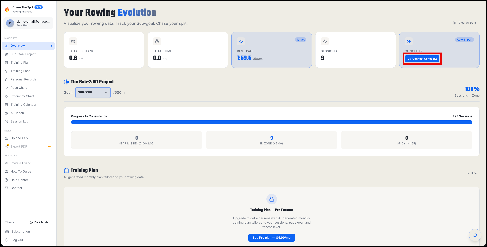
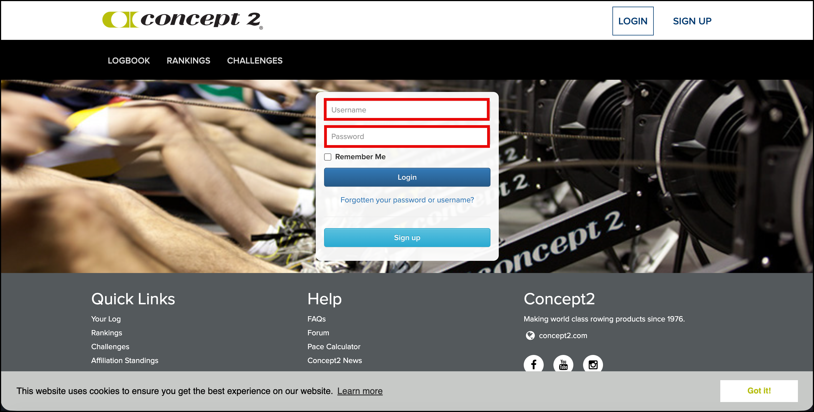
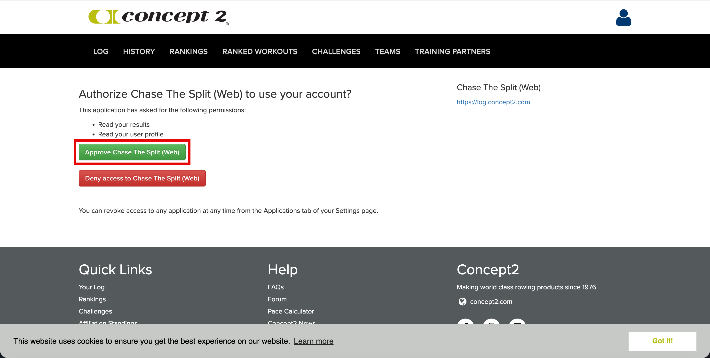
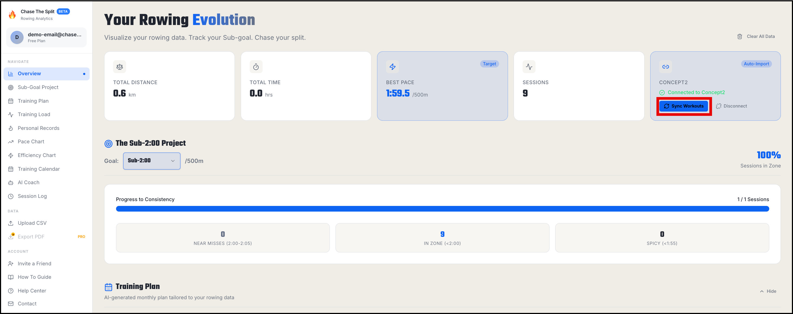

---

title: Connect to Concept2 Logbook

---

Follow these four steps to link your Chase The Split dashboard with your Concept2 account and automatically import your rowing workouts.

## Step 1 — Start the connection between Concept2 and Chase The Split from your dashboard

On your Chase The Split dashboard, click the blue **Connect Concept2 button** in the blue Concept2 card.

## Step 2 — Log in to your Concept2 account

Enter your Concept2 username and password on the Concept2 website and then click the **Login** button.

 

## Step 3 — Authorize Chase The Split to connect to Concept2

Click the green **Approve Chase The Split (Web)** button.

 

## Step 4 — Sync your Concept2 workouts to Chase The Split

The Concept2 card now displays "Connected to Concept2" in the blue Concept2 card. Click the **Sync Workouts** button to pull in your rowing data.

