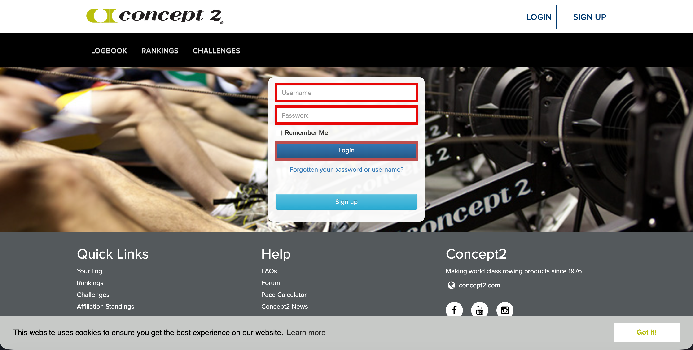
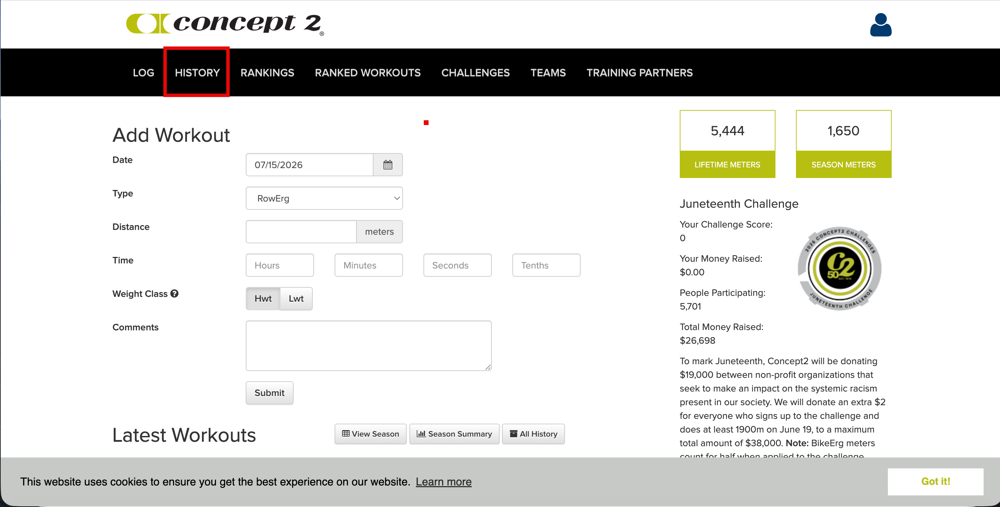
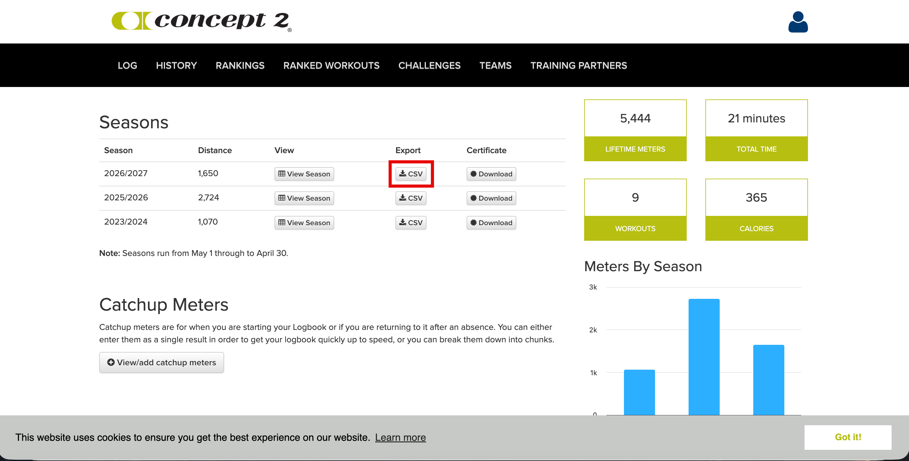
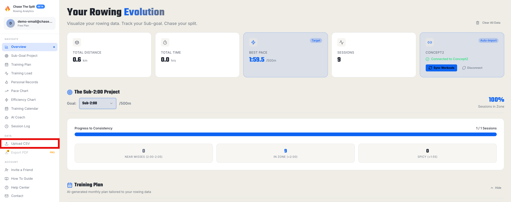
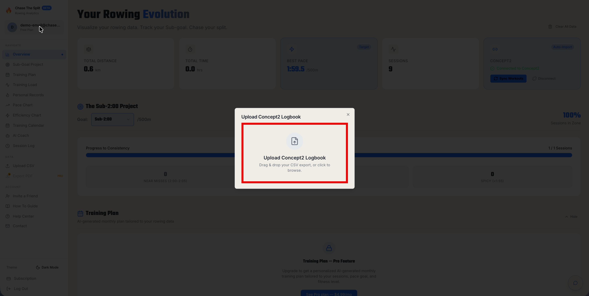

---

title: Import Concept2 Logbook by CSV

---

Follow the below steps to export any season from your Concept2 Logbook as a CSV file and upload it directly to Chase The Split.

#### Step 1

Go to the Concept2 website (www.concept2.com). Select the Logbook tab on the top toolbar.

#### Step 2

Click the **LOGIN** button in the upper right.

#### Step 3

Enter your Concept2 username and password and then click the Login button.

#### Step 4

Select the History tab on the top toolbar.

#### Step 5

Click the **CSV** button next to a season.

#### Step 6

Navigate to the Chase The Split dashboard. Select Upload CSV on the left pane.

#### Step 7

Drag and drop your CSV (or click to browse) in the upload window.

#### Step 8

Select the file in the pop-up window and click the **Open** button.
