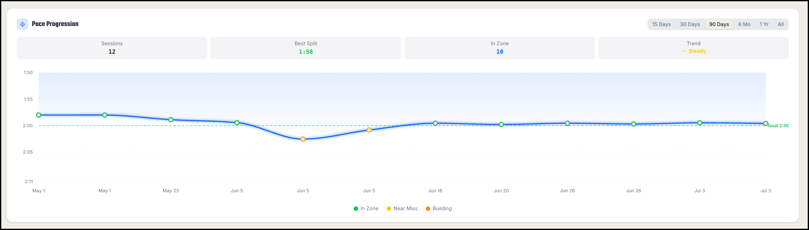

---

title: What do the Pace Zones Mean? (In Zone, Near Miss, Building)

---

Every workout on your dashboard is color-coded into one of three pace zones. The zones are based on your average pace per 500m compared to your personal pace goal — so they're unique to you, and they update automatically if you ever change your goal.

#### In Zone (green)

Your average pace was at or faster than your goal. If your goal is 2:00 and you row a 1:58.5, that workout is In Zone. These are the sessions you're chasing — your dashboard counts them, and your In Zone total is one of the fastest ways to see your progress over time.

#### Near Miss (yellow)

Your average pace was within 5 seconds of your goal. Against a 2:00 goal, that's anything from 2:00.1 to 2:05.0. Near Misses are a good sign, not a failure — they mean you're knocking on the door. A cluster of yellow sessions usually comes right before your first green one.

#### Building (orange)

Your average pace was more than 5 seconds over your goal. These are your base-building sessions — longer, steadier rows where you're developing fitness rather than chasing a number. Every rower needs them. A healthy training log has plenty of orange in it.

#### Where you'll see the zones

The zones appear everywhere on your dashboard: as colored dots on your Pace Progression chart, as colors on the Efficiency chart, and as labels on each workout card. Hover over any dot on a chart to see the exact pace and zone for that session.

Your goal tracker at the top of the dashboard also tallies your sessions by zone:

Goal tracker widget showing Progress to Consistency bar with Near Misses, In Zone, and Spicy session counts

You'll notice a bonus tier there: Spicy counts your sessions more than 5 seconds faster than your goal — the rows where you didn't just hit the target, you blew past it.

#### The zones follow your goal

The zones aren't fixed at 2:00 — they're always relative to the pace goal you've chosen. Change your goal from 2:00 to 1:55, and every workout re-shades instantly against the new target. A session that was In Zone yesterday might show as a Near Miss today, because the bar moved, not because you got slower.

#### How to use the zones

Don't aim for all green. If every session is In Zone, your goal is too easy — move it down. If everything is orange, pick a friendlier goal and work back. The sweet spot is a mix: mostly green and yellow on your harder days, orange on your long steady days.
